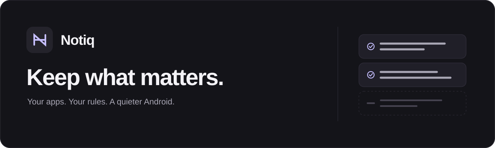

<p align="center">
  
</p>

<p align="center">
  A native Android notification filter, guided by your rules.
  <br />
  <strong>English</strong> · <a href="README.zh-CN.md">简体中文</a>
</p>

<p align="center">
  <a href="#getting-started">Get started</a> ·
  <a href="#privacy">Privacy</a> ·
  <a href="#build">Build</a> ·
  <a href="#limitations">Limitations</a>
</p>

---

Keep messages, deliveries and security alerts. Filter the promotions you would rather skip.

Notiq pairs Android notification access with [Jev](https://docs.typesafe.ai/introduction) or your own [FastJev](https://github.com/chengyongru/fastjev) server. Choose the apps, describe what matters in plain language, and review the decisions before letting Notiq handle delivery.

> **Early preview · Android 10+**<br />
> Observe mode is on by default. Filtering happens **after** a notification is posted, so its first sound, vibration or banner may still get through.

## Your notifications, your call

| Choose the scope | Write the rules | Own the setup |
| :--- | :--- | :--- |
| Select individual apps. Leave the rest alone. | Start with a preset or give each app its own instructions. | Use official Jev or a self-hosted FastJev API. |

- **Observe first.** Review decisions without removing notifications. Mark mistakes for your own review; feedback does not train the model automatically.
- **Deliver on uncertainty.** In filtering mode, failed requests, uncertain answers and scores below the threshold trigger a Notiq reminder. Observe mode leaves the originals untouched.
- **Native and quiet.** Kotlin + Jetpack Compose, light and dark themes, English and Simplified Chinese. No model runs on the phone.

## Getting started

Install a locally built APK, then:

1. In **Settings**, choose a service, enter its configuration, save and test the connection.
2. In **History**, select **Allow notification access** and enable Notiq in Android settings. Also allow Notiq to send notifications. **Settings → Notification settings** opens its reminder controls.
3. In **Apps**, choose which apps to filter. Each bell opens instructions and a shortcut to that app’s Android notification settings.
4. In **Rules**, pick a preset or write your own instructions.
5. Leave **Observe mode** on while reviewing new notifications. Turn it off when you are ready to let Notiq remove incoming notifications and forward those worth keeping.

Changing the service, rules or app selection turns observe mode back on. Only new notification events are processed; existing notifications are not scanned.

For reminders only after a decision, use the bell to silence the source app’s message notifications: keep notifications allowed, but disable banners, sound and vibration. Keep call alerts enabled. Allow banners for Notiq, then turn observe mode off. Do not disable the source app’s notification permission: Notiq needs the posted notifications to read their content. Settings vary by device and notification category.

These Android settings remain in effect when observe mode is on, an app is deselected, or Notiq stops running. Restore the original alerts when you stop using Notiq. Protected or unreadable notifications stay in the shade and are not forwarded; if their channel is silent, they remain silent.

**A rule can be this simple:**

> Filter only clear promotions, referral campaigns, coupons and commercial ads. Keep personal messages, payments, orders, deliveries, refunds, support updates, security alerts and service status updates. If unsure whether a notification is an ad, keep it.

The interface follows your system language. On Android 13+, you can also choose English or Chinese in Android’s per-app language settings. Saved custom rules and notification contents are never translated automatically.

### Connect a service

| Setting | Official Jev | Self-hosted FastJev |
| :--- | :--- | :--- |
| Service URL | `https://api.typesafe.ai` | Your server URL |
| Model | `jev-latest` | Your server’s `served-model` name |
| API key | Your Jev key | As required by your server |
| Default filter threshold | `0.98` | `0.995` |
| Inference runs on | The official service | Your computer or server |

Notiq calls `POST /v1/systemone`. The APK includes neither model weights nor an API key. Enter a base URL, optionally ending in `/v1`, without `/systemone`. Remote servers require HTTPS; HTTP is allowed only for `127.0.0.1` and `localhost` debugging.

A threshold is an action gate, **not an accuracy guarantee**. FastJev scores are uncalibrated; increasing the threshold does not eliminate mistakes.

<details>
<summary><strong>Local FastJev setup with Qwen3.5-4B</strong></summary>

Install `fastjev[api,torch]` on your computer. This example needs a CUDA environment with BF16 support:

```powershell
fastjev-serve --backend torch --device cuda --dtype bfloat16 `
  --model Qwen/Qwen3.5-4B `
  --revision 851bf6e806efd8d0a36b00ddf55e13ccb7b8cd0a `
  --served-model fastjev-qwen3.5-4b `
  --served-model-description 'Qwen3.5-4B BF16 via FastJev' `
  --served-model-release-date 2026-09-18 --port 8000
```

You can use a local model directory for `--model`. With a debugging-enabled phone connected, forward the server port:

```shell
adb reverse tcp:8000 tcp:8000
```

In Notiq, set the URL to `http://127.0.0.1:8000` and the model to `fastjev-qwen3.5-4b`, replacing the initial `fastjev-local` value. The phone’s loopback address now reaches your computer through ADB. Reconnect the forwarding after disconnecting ADB; an unreachable service triggers a fallback reminder in filtering mode.

</details>

## Privacy

**Observe mode still sends requests.** It disables removal, not network access.

For selected notifications that need a decision, Notiq sends the app name, package name, title, body and filtering rule to your configured service. Official Jev receives these requests when selected; a self-hosted FastJev server receives them when selected. Notification text is not automatically redacted.

History and feedback stay in a local Room database. Before removing a notification, Notiq saves its text for recovery. Pending deliveries are retained until completed; other records older than seven days are cleaned up at startup and by a periodic task. The UI shows up to 500 recent records. You can clear history manually. API keys are encrypted with an Android Keystore-backed key, and app backup is disabled. Request retention on the inference server depends on that service’s settings and policies.

## Limitations

| What to expect | Current behavior |
| :--- | :--- |
| First alert | Android delivers the [listener callback](https://developer.android.com/reference/android/service/notification/NotificationListenerService) after posting. Removal cannot reliably prevent the initial alert. |
| Incorrect decisions | Rules and thresholds reduce risk, but cannot guarantee zero false positives. Notiq forwards a new notification; it cannot recreate every source action, reply control or attachment. |
| Background execution | Device power management may delay processing. Pending content is delivered when Notiq resumes or reconnects; recovery opens Notiq history because the original action is no longer available. Some devices need notification access re-enabled after an update. |
| Protected notifications | Ongoing notifications, group summaries, calls, alarms and media notifications are kept. Protection depends on the flags/categories reported by Android. |
| Request limits | Empty content and content over 6,000 characters stay unchanged. Requests beyond two concurrent calls skip inference and forward a reminder in filtering mode. Calls have a 12-second timeout; background scheduling may delay handling. |
| Real-world coverage | Most testing has used synthetic notifications. WeChat and other third-party apps, overnight use and reboot recovery are not fully validated. |

### One delivery flow

In filtering mode, eligible notifications follow one path: **save → remove → decide → filter or forward**. Repeated notifications are processed again. The history distinguishes **Forwarded**, **Filtered** and **Awaiting delivery**. If Notiq cannot send notifications, it leaves the source notification in place.

To avoid the source app’s first alert, silence its message notifications through the bell shortcut. Notiq does not change or verify another app’s notification settings automatically. The original may briefly appear in the shade; a kept notification alerts only after the decision completes. See [delivery verification](docs/notification-delivery.md).


## Build

Use JDK 17 or a compatible JDK 21, plus Android SDK Platform 36. The repository includes the Gradle Wrapper. Set your SDK path in an untracked `local.properties`:

```properties
sdk.dir=C:/Android/Sdk
```

```powershell
# Windows
.\gradlew.bat :app:assembleDebug :app:testDebugUnitTest :app:lintDebug
```

```shell
# macOS / Linux
bash ./gradlew :app:assembleDebug :app:testDebugUnitTest :app:lintDebug
```

APK: `app/build/outputs/apk/debug/app-debug.apk`.

<details>
<summary><strong>Test with synthetic notifications</strong></summary>

The `fixture` module builds a separate sender app; it is not bundled into Notiq.

```shell
bash ./gradlew :fixture:assembleDebug
adb install -r app/build/outputs/apk/debug/app-debug.apk
adb install -r fixture/build/outputs/apk/debug/fixture-debug.apk
adb shell pm grant dev.notiq.fixture android.permission.POST_NOTIFICATIONS
```

On Windows, replace `bash ./gradlew` with `.\gradlew.bat`. Select **Notiq 测试通知** in Notiq, keep observe mode on, then send promotion and delivery samples from the fixture. Check the decision history and confirm the original notifications remain. Stop the decision service to test failure handling.

</details>

### Inside the project

| Path | Purpose |
| :--- | :--- |
| `app/src/main/java/dev/notiq/ui` | Compose screens, ViewModel and UI state |
| `app/src/main/java/dev/notiq/notifications` | Listener, protection checks and removal |
| `app/src/main/java/dev/notiq/network` | System One requests and response parsing |
| `app/src/main/java/dev/notiq/data` | Room history, DataStore settings and key storage |
| `app/src/main/res/values*` | English and Chinese interface strings |
| `fixture` | Synthetic notification sender |

Built with Kotlin, Compose, ViewModel / StateFlow, Room, DataStore, OkHttp and WorkManager.

## Testing & feedback

Device testing has used a vivo V2454A running Android 16. All engineering notes are available in English and Simplified Chinese:

| Document | English | 简体中文 |
| :--- | :--- | :--- |
| Initial device verification | [Read](docs/verification.md) | [阅读](docs/verification.zh-CN.md) |
| Prompt evaluation | [Read](docs/prompt-evaluation.md) | [阅读](docs/prompt-evaluation.zh-CN.md) |
| Notification delivery | [Read](docs/notification-delivery.md) | [阅读](docs/notification-delivery.zh-CN.md) |
| Notification assistant availability | [Read](docs/notification-assistant-check.md) | [阅读](docs/notification-assistant-check.zh-CN.md) |

These are scoped test results, not an accuracy benchmark.

For bug reports, include your phone model, Android and Notiq versions, service type and reproduction steps. Use synthetic or redacted notification examples. Never include API keys, verification codes or private messages.

---

[TypeSafe API](https://docs.typesafe.ai/api) · [FastJev System One API](https://github.com/chengyongru/fastjev/blob/main/docs/SYSTEM_ONE_API.md) · [简体中文](README.zh-CN.md)
