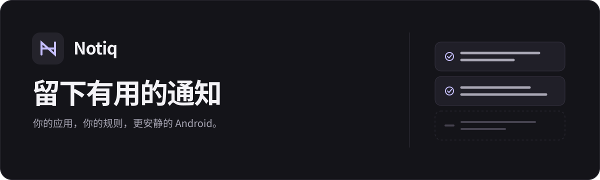

<p align="center">
  
</p>

<p align="center">
  留下有用的通知，过滤不想看的推广。
  <br />
  <a href="README.md">English</a> · <strong>简体中文</strong>
</p>

<p align="center">
  <a href="#开始使用">开始使用</a> ·
  <a href="#隐私与数据">隐私与数据</a> ·
  <a href="#本地构建">本地构建</a> ·
  <a href="#当前边界">当前边界</a>
</p>

---

Notiq 是一款原生 Android 通知过滤器。选择应用，用自然语言写下过滤规则，再交给 Jev 或自部署的 [FastJev](https://github.com/chengyongru/fastjev) 判断。你可以只过滤优惠券和拉新广告，同时保留消息、订单、物流和安全提醒。

默认开启**观察模式**：先看判断结果，再决定是否自动移除通知。

> 当前版本为早期预览，支持 Android 10 及以上。过滤发生在通知发布之后，无法保证阻止第一次响铃、震动或横幅。自动过滤使用“先移除、再判断、按需转发”的统一流程。

## 由你决定，哪些值得提醒

| 选择应用 | 写下规则 | 选择服务 |
| :--- | :--- | :--- |
| 按应用开启，只处理你选中的通知。 | 从预设开始，也可以给每个应用独立规则。 | 官方 Jev 或你自己的 FastJev 服务器。 |

- **按应用选择**：只处理你选中的应用，支持搜索和应用图标。
- **自然语言规则**：全局规则与单应用独立规则，内置「保守过滤」「交易优先」「减少打扰」三种预设。
- **可选判断服务**：官方 Jev 或自部署 FastJev，分别保存地址、模型、密钥和过滤阈值。
- **先观察，再过滤**：查看通知、判断结果和处理原因，标记「应该保留」或「应该过滤」。反馈保存在本机，目前不会自动训练模型。
- **保守处理**：自动过滤时，服务失败、不确定或未达到阈值都会转发提醒；保护持续通知、分组摘要、通话、闹钟和媒体通知。
- **原生界面**：Kotlin + Jetpack Compose，支持浅色、深色与跟随系统，以及中英双语。

## 开始使用

安装本地构建的 APK 后：

1. 在「设置」中选择判断服务，填写配置，保存并测试连接。
2. 在「记录」中点击「连接通知权限」，在系统设置中允许 Notiq 读取通知，并允许 Notiq 发送通知。「设置 → 提醒设置」可以调整 Notiq 的提醒方式。
3. 在「应用」中选择要处理的应用。每个应用旁的铃铛提供设置指引，并直达该应用的系统通知设置。
4. 在「规则」中选择预设，或写下自己的要求。
5. 保持观察模式，等待这些应用的新通知，并检查判断是否符合预期。
6. 确认后，在「记录」中关闭观察模式，开启自动过滤：Notiq 先移除通知，再转发需要保留的内容。

修改服务、规则或应用选择后，会重新开启观察模式。Notiq 只处理后续收到的新通知，不会扫描已有通知。

如果希望先判断再提醒，点击铃铛，将原应用的消息通知设为静默：保留「允许通知」，关闭横幅、声音和振动，保留来电提醒。允许 Notiq 显示横幅，再关闭观察模式。不要关闭原应用的通知总开关，否则 Notiq 无法通过通知读取内容。不同机型和通知类别的设置可能不同。

开启观察模式、取消应用选择或 Notiq 停止运行，都不会自动恢复原应用的提醒。停用时请自行恢复。受保护、无法读取或过长的通知保留原样，不会补发；所属类别设为静默后，这些通知也会保持静默。

界面默认跟随系统语言；Android 13 及以上也可以在系统的应用语言设置中单独选择英文或中文。已保存的自定义规则与通知内容不会自动翻译。

一段规则可以这样写：

> 仅过滤明确的促销、拉新、领券和商业广告。保留私人消息、支付、订单、物流、退款、售后、安全提醒和服务状态。无法确认是广告时保留。

### 选择判断服务

| 配置 | 官方 Jev | 自部署 FastJev |
| --- | --- | --- |
| 服务地址 | `https://api.typesafe.ai` | 你的 FastJev 服务地址 |
| 模型 | `jev-latest` | 与服务端的 `served-model` 一致 |
| API 密钥 | 填写自己的 Jev 密钥 | 按服务端配置填写 |
| 默认过滤阈值 | 0.98 | 0.995 |
| 推理位置 | 官方服务 | 你部署的电脑或服务器 |

手机通过 `POST /v1/systemone` 请求判断，**不在手机上运行模型**。APK 不包含模型权重或推理运行时，也不提供内置 API 密钥。

地址填写服务根路径或以 `/v1` 结尾的路径，不包含 `/systemone`。远程地址必须使用 HTTPS；仅 `127.0.0.1` 和 `localhost` 支持 HTTP 调试。

阈值是执行过滤的门槛，不代表已验证的准确率。FastJev 模型分数未经校准；小模型即使提高阈值，也可能漏判或误判。

<details>
<summary>在电脑上运行 FastJev，通过 ADB 连接手机</summary>

在电脑上安装 `fastjev[api,torch]`，启动 Qwen3.5-4B 的 System One 兼容服务。下面的配置需要支持 CUDA 和 BF16 的运行环境：

```powershell
fastjev-serve --backend torch --device cuda --dtype bfloat16 `
  --model Qwen/Qwen3.5-4B `
  --revision 851bf6e806efd8d0a36b00ddf55e13ccb7b8cd0a `
  --served-model fastjev-qwen3.5-4b `
  --served-model-description 'Qwen3.5-4B BF16 via FastJev' `
  --served-model-release-date 2026-09-18 --port 8000
```

已有完整权重时，`--model` 可以填写本地模型目录。服务默认监听电脑的 `127.0.0.1:8000`。连接开启调试的手机后执行：

```shell
adb reverse tcp:8000 tcp:8000
```

在 Notiq 中填写：

- 服务地址：`http://127.0.0.1:8000`
- 模型：`fastjev-qwen3.5-4b`（需要替换应用初始值 `fastjev-local`）

这里的手机回环地址通过 ADB 转发到电脑。断开调试连接后需重新建立转发；服务不可达时，自动过滤模式会补发提醒。

</details>

## 隐私与数据

**观察模式也会调用判断服务。** 它只是不执行移除，不是离线模式。

对于选中应用中需要判断的通知，Notiq 会向你配置的服务发送应用名称、包名、通知标题、正文及过滤规则。使用官方 Jev 时，这些内容会发送到官方服务；使用自部署 FastJev 时，会发送到你的服务。Notiq 不会先对通知内容做脱敏，请据此选择应用与服务。

通知记录、判断结果和反馈保存在手机的 Room 数据库中。Notiq 在移除前保存待处理通知的文本；未完成的转发保留至处理完成，不随清空记录或定期清理而删除。其他超过 7 天的记录在启动时及定期任务中清理，界面最多显示最近 500 条。API 密钥使用 Android Keystore 保护的密钥加密保存，应用备份已关闭。所选服务如何保存请求数据，取决于该服务的配置与政策。

## 当前边界

- **不能保证“完全不打扰”**：[`NotificationListenerService`](https://developer.android.com/reference/android/service/notification/NotificationListenerService) 在通知发布后收到回调。自动过滤会请求移除通知，但最初的声音或横幅可能已经出现。
- **不能承诺零误删**：保护规则和阈值降低风险，但模型判断仍可能出错。移除通知后，Notiq 无法恢复原通知；保留的文本记录不等于原通知的操作入口。
- **后台运行受系统影响**：部分机型可能限制后台执行；覆盖安装后，也可能需要重新授予通知读取权限。后台仍可能出现明显延迟。处理被中断时，会在 Notiq 恢复运行或重连后补发保存的文本；恢复提醒点击后打开 Notiq 记录，不保证恢复原应用入口。
- **内容与并发有限制**：空内容、超过 6000 字符的内容和受保护通知跳过判断并保留原样。超过两个并发请求时跳过推理，自动过滤模式直接转发提醒。网络调用设有 12 秒超时，但后台调度可能延迟结果处理。
- **验证范围有限**：目前主要使用独立测试应用的合成通知。尚未完成微信等真实第三方应用、长期后台、锁屏过夜及重启恢复的系统性验证。

### 一套通知处理流程

自动过滤时，符合处理条件的通知统一走 **保存 → 移除 → 判断 → 过滤或转发**。相同内容再次到达也会处理；记录明确显示「已转发」「已过滤」或「等待转发」。如果 Notiq 没有发通知的权限，会保留原通知。

要避免原应用第一次打扰，需要通过铃铛入口将其消息通知设为静默。Notiq 不会自动修改或确认其他应用的通知设置。原通知仍可能短暂出现在通知栏，需要保留的通知会在判断完成后提醒。详见[通知转发验证](docs/notification-delivery.zh-CN.md)。

## 本地构建

需要 JDK 17 或兼容的 JDK 21、Android SDK Platform 36。项目包含 Gradle Wrapper。

在未跟踪的 `local.properties` 中设置 SDK 路径，例如：

```properties
sdk.dir=C:/Android/Sdk
```

Windows PowerShell：

```powershell
.\gradlew.bat :app:assembleDebug :app:testDebugUnitTest :app:lintDebug
```

macOS / Linux：

```shell
bash ./gradlew :app:assembleDebug :app:testDebugUnitTest :app:lintDebug
```

调试 APK 位于 `app/build/outputs/apk/debug/app-debug.apk`。`fixture` 是独立的测试通知发送器，不包含在 Notiq APK 中：

```shell
bash ./gradlew :fixture:assembleDebug
adb install -r app/build/outputs/apk/debug/app-debug.apk
adb install -r fixture/build/outputs/apk/debug/fixture-debug.apk
adb shell pm grant dev.notiq.fixture android.permission.POST_NOTIFICATIONS
```

Windows 使用 `.\gradlew.bat` 替换 `bash ./gradlew`。在 Notiq 中选择「Notiq 测试通知」，保持观察模式，再从测试应用发送促销或物流通知。检查判断记录及原通知；停止判断服务后，可验证失败时保留通知。

## 项目结构

| 目录 | 职责 |
| --- | --- |
| `app/src/main/java/dev/notiq/ui` | Compose 界面、ViewModel 与界面状态 |
| `app/src/main/java/dev/notiq/notifications` | 通知监听、保护条件与移除检查 |
| `app/src/main/java/dev/notiq/network` | System One 请求与响应解析 |
| `app/src/main/java/dev/notiq/data` | Room 记录、DataStore 配置与密钥存储 |
| `app/src/main/res/values*` | 中英文界面资源 |
| `fixture` | 合成通知测试应用 |

技术栈：Kotlin、Jetpack Compose、ViewModel / StateFlow、Room、DataStore、OkHttp、WorkManager。

## 验证与反馈

已在 vivo V2454A（Android 16）上进行真机验证。所有工程文档均提供中英文版本：

| 文档 | 简体中文 | English |
| --- | --- | --- |
| 基础链路与本地 4B 服务验证 | [阅读](docs/verification.zh-CN.md) | [Read](docs/verification.md) |
| 提示词与官方 Jev 对照验证 | [阅读](docs/prompt-evaluation.zh-CN.md) | [Read](docs/prompt-evaluation.md) |
| 通知转发验证 | [阅读](docs/notification-delivery.zh-CN.md) | [Read](docs/notification-delivery.md) |
| 通知助理可用性验证 | [阅读](docs/notification-assistant-check.zh-CN.md) | [Read](docs/notification-assistant-check.md) |

这些是限定范围的测试结果，不是准确率基准。

提交问题时，请附上手机型号、Android 版本、Notiq 版本、服务类型和复现步骤。通知示例请使用合成或脱敏内容，不要附上 API 密钥、验证码或私人消息。

协议参考：[TypeSafe API](https://docs.typesafe.ai/api) · [FastJev System One API](https://github.com/chengyongru/fastjev/blob/main/docs/SYSTEM_ONE_API.md)
